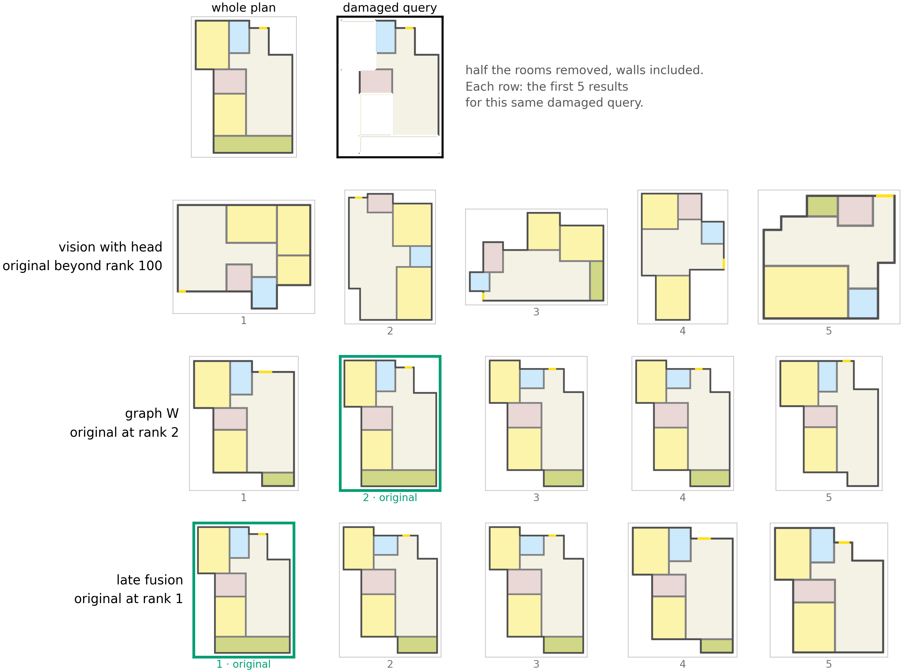
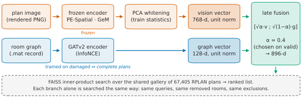
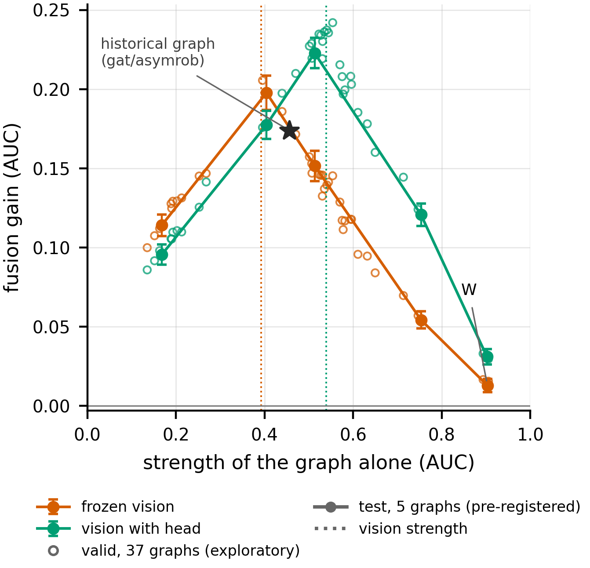
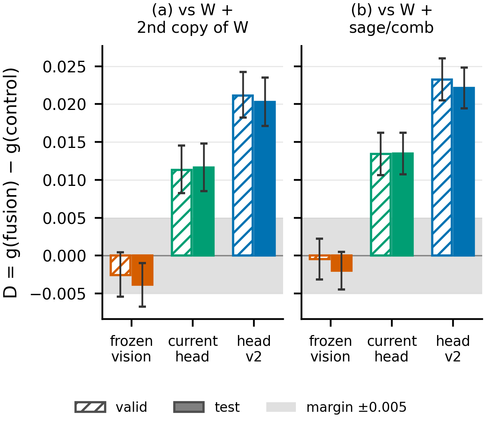
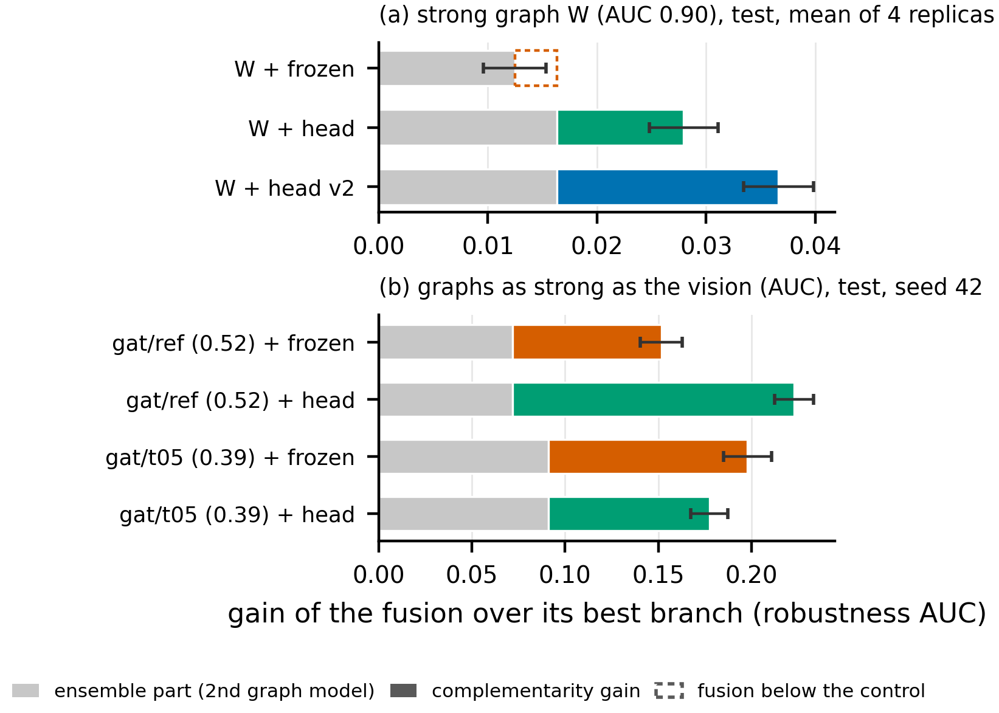
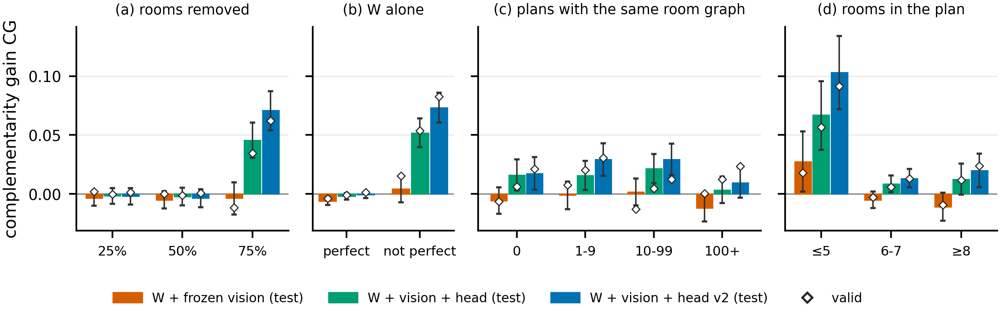

<div align="center">

# FusePlan: Separating Complementarity from Ensemble Effects in Partial Floor Plan Retrieval

**Retrieving complete floor plans from incomplete queries, with a room-graph branch, an image branch, and a controlled
study of when their fusion actually adds information.**

</div>

<p align="center">
  
</p>
<p align="center"><sub>A validation query with half of its rooms removed (left) and the top-5 results of the vision branch
with head, the graph branch W and their fusion; the original plan is framed. Only the fusion ranks it first (the graph
ranks a near-duplicate plan first).</sub></p>

## Overview

Architects rarely start from a finished layout: they start from a few rooms or an outline and look for similar
precedents. FusePlan studies **floor-plan retrieval when the query is incomplete**. The query is a plan with part of its
content removed, and the target is the complete plan, retrieved from the **whole RPLAN corpus (67,405 plans)**.

Two branches share the same gallery, damages, metrics and ground truth:

- **Graph branch.** The plan's `.mat` annotation becomes a room graph: rooms are nodes (type, box, area, aspect) and
  adjacencies are edges (spatial relation). A GATv2 encoder is trained with InfoNCE on *damaged plan ↔ complete plan*
  pairs, and the checkpoint is chosen on robustness.
- **Vision branch.** A frozen image encoder embeds the rendered plan, followed by PCA whitening fit on train. Eight
  encoders were benchmarked; the final one is PE-Spatial. Optionally, a light projection head is trained on the damage.
- **Late fusion.** The weighted concatenation of the two L2-normalised vectors, `[√α·v ; √(1−α)·g]`, gives
  `α·sim_vision + (1−α)·sim_graph` in a single FAISS index. α is chosen on validation only.

<p align="center">
  
</p>

### Contributions

1. **A graph branch for incomplete plans close to the ceiling.** The configuration was searched the same way for GCN,
   GraphSAGE and GAT: 37 candidates × 4 seeds, validation only. The chosen encoder reaches a robustness AUC of
   **0.904 ± 0.001** on test. It beats LayoutGKN retrained with the same signal (0.611).
2. **Complementarity vs. ensemble effect, measured with controls.** Every fusion gain is compared with the gain of
   fusing the graph with a model that carries the *same* information: a second training of the same graph, or a
   GraphSAGE encoder. With a strong graph, a frozen vision encoder does not go beyond this ensemble effect. A vision
   branch trained on the damage does. We call the gain beyond the stronger control the **complementarity gain**: even
   when it is positive, about half of the fusion gain is ensemble effect, and it appears only where the graph is left
   with little information.
3. **The fusion gain depends on the relative strength of the branches.** Across 37 graphs, the gain follows an inverted
   U: largest when the branches are comparable, small when one branch is near the ceiling.
4. **An evaluation protocol for partial-query retrieval.**
   - Robustness is measured as the AUC of self-recovery over three kinds of damage: room removal, crop and patch masking.
   - Relevance ground truth is decomposed per axis (composition, topology, geometry) and normalised on the
     random-ranking floor.
   - Comparisons are paired, with bootstrap CIs.
   - Hypotheses and test readings were pre-registered.
5. **Negative results reported as such.**
   - A head trained on one damage does not transfer to others.
   - A rendering artefact once accounted for almost all of the measured vision robustness.
   - Selecting graph checkpoints on full-plan retrieval is erratic.

## Results

All numbers are on the **test split**, read once per pre-registered round. There are 2000 queries, and the whole
gallery is searched. *Robustness AUC* is the mean reciprocal rank of the original plan with 25 / 50 / 75 % of its rooms
removed (self-recovery); higher is better. Brackets are 95 % paired-bootstrap CIs.

**Main comparison** (replica seed 42; means over the 4 replicas: W 0.9040 ± 0.0010, fusion 0.9165 ± 0.0010, fusion with
head 0.9319 ± 0.0014):

| Method | AUC | f = 0.25 | f = 0.50 | f = 0.75 |
|---|:---:|:---:|:---:|:---:|
| Room-type histogram (training-free) | 0.001 | 0.003 | 0.001 | 0.000 |
| Frozen vision (PE-Spatial) | 0.397 | 0.822 | 0.304 | 0.064 |
| Vision + head trained on room removal | 0.533 | 0.896 | 0.530 | 0.173 |
| LayoutGKN (BMVC 2025), retrained with our signal | 0.611 | 0.940 | 0.676 | 0.217 |
| **Graph W (GATv2)** | **0.903** | **0.963** | 0.954 | 0.793 |
| Fusion W + frozen vision | 0.916 | 0.961 | 0.955 | 0.832 |
| **Fusion W + vision with head** | **0.934** | **0.963** | **0.958** | **0.881** |

**Does the vision branch bring its own information?**

The table reports D = gain of the fusion − gain of an ensemble control. The values are means over 4 replicas.

| Vision branch fused with W | D vs. W + second copy of W | D vs. W + GraphSAGE |
|---|:---:|:---:|
| Frozen | −0.0038 [−0.0067, −0.0010] | −0.0020 [−0.0045, +0.0005] |
| Head trained on room removal | +0.0116 [+0.0085, +0.0148] | +0.0135 [+0.0107, +0.0162] |
| Head v2 (three damages, query side only) | **+0.0203** [+0.0171, +0.0235] | **+0.0221** [+0.0195, +0.0248] |

With a near-ceiling graph, a frozen vision encoder adds nothing beyond what a second graph model would add. A vision
branch trained on the damage goes beyond it, and so does a head trained on all three damages. The head v2 is also far
more robust on its own: its mean AUC over the three damages is 0.715, against 0.521 for the frozen encoder.

<p align="center">
  
  
</p>
<p align="center"><sub>Left: fusion gain against graph strength (37 graphs on validation, 5 on test), an inverted U. Right:
D against the two ensemble controls for the three vision branches, validation (hatched) and test (filled); the grey band is the
±0.005 equivalence margin.</sub></p>

**How much of the gain is the vision's own, and where?** The *complementarity gain* is
CG = g(vision + graph) − g(stronger ensemble control): the part of the fusion gain that a second graph model would not
give. On test, 32–58 % of every fusion gain is ensemble effect (left). A per-query breakdown (right; post-hoc, seed 42)
places the whole CG at the heaviest damage (75 % of rooms removed: +0.046 with the head, +0.071 with head v2), on the
queries the graph alone gets wrong, and on small plans. It does not grow on plans whose room graph is shared by many
gallery plans.

<p align="center">
  
  
</p>
<p align="center"><sub>Left: fusion gain split into the part a second graph model gives (grey) and the complementarity
gain (colour, 95 % CI), for W (4 replicas) and for graphs as strong as the vision. Right: CG per level of damage, whether
W alone is already perfect, number of gallery plans with the same room graph, and plan size (test bars, validation
diamonds).</sub></p>

**Fusion gain on the test set as a function of graph strength** (mean over 4 seeds; graph AUC in parentheses):

| Graph | gcn/ref (0.160) | gat/t05 (0.385) | gat/ref (0.520) | gat/t01 (0.745) | W (0.904) |
|---|:---:|:---:|:---:|:---:|:---:|
| + frozen vision | +0.111 | **+0.198** | +0.146 | +0.057 | +0.012 |
| + vision with head | +0.096 | +0.173 | **+0.222** | +0.123 | +0.027 |

## Installation

```bash
git clone https://github.com/290990-collab/CVCS-AI-Assisted-ID.git
cd CVCS-AI-Assisted-ID
python3.10 -m venv floorplan-env && source floorplan-env/bin/activate
pip install -r requirements.txt          # PyTorch 2.7 (CUDA 11.8), PyTorch Geometric 2.7, timm, transformers, FAISS
python -m pytest tests -q                # CPU smoke tests
```

On a fresh clone, 395 of the 419 tests run. The others read stored results that are not part of the repository: fusion,
ensemble controls, the multi-seed round and LayoutGKN.

## Data

FusePlan uses [RPLAN](http://staff.ustc.edu.cn/~fuxm/projects/DeepLayout/index.html) (Wu et al., ACM TOG 2019),
which must be obtained from its authors. The code expects the layout of the Graph2Plan release:
- **Images:** the plan images in `Interface/static/Data/snapshot_train/`.
- **Annotations:** the `.mat` files in `Network/data/`.

Set the paths in three places: `configs/vision_retrieval.yaml` (`data_dir`), `src/data/rplan_metadata.py` and
`src/graph/graph_dataset.py`. Then build the shared gallery and the graph cache:

```bash
python -m src.evaluation.gallery_join            # shared gallery of both branches -> results/shared_gallery.json
sbatch scripts/graph/02_graph_dataset.sh         # RPLAN .mat -> room graphs, cached PyG dataset
sbatch scripts/vision/01_extract_raw.sh pespatial  # raw image embeddings (any of the 8 encoders)
```

## Training

All heavy steps are SLURM jobs in `scripts/`, numbered in execution order. Each script documents its arguments in its
header.

```bash
# Graph branch: one configuration and one seed per job (37 configurations x 4 seeds in the study; W = gat comb)
sbatch scripts/final_pipeline/01_train_graph.sh gat comb 42
python -m src.graph.final_graph_configs configs --encoder gat   # list the configurations of an encoder

# Vision heads on the frozen encoder
EPOCHS=5000 PATIENCE=100 HEAD_FILE=head_nowalls_conv.pt EXTRA="training.damage=nowalls_random" \
  sbatch scripts/vision/09_train_head_probe.sh pespatial gem      # head on room removal (pair cache: see the script header)
sbatch scripts/vision/10_prepare_head_v2.sh && sbatch scripts/vision/11_train_head_v2.sh   # head v2, three damages

# Baseline
sbatch scripts/competitors/02_layoutgkn_full.sh          # LayoutGKN retrained with our signal
```

## Evaluation and fusion

```bash
# Graph: evaluation under room removal (writes per-query files and damaged query vectors)
sbatch scripts/final_pipeline/02_eval_graph.sh gat comb 42 valid
python -m src.evaluation.graph_config_select final       # validation-only choice of the graph

# Vision: three damages (room removal, crop, patch masking)
sbatch scripts/vision/06_eval_frozen_partial.sh pespatial

# Late fusion W + frozen vision: alpha grid on validation, then the test with alpha fixed
sbatch scripts/final_pipeline/03_fusion_frozen_vision.sh valid 42
bash   scripts/final_pipeline/04_fusion_frozen_vision_select.sh select valid 42

# Ensemble controls, fusion with the heads, gain vs graph strength, multi-seed round
sbatch scripts/final_pipeline/05_ensemble_controls.sh fuse replica
sbatch scripts/final_pipeline/07_fusion_head.sh valid 42
sbatch --array=0-73%24 scripts/final_pipeline/09_fusion_curve.sh
sbatch --array=0-10 scripts/final_pipeline/12_eval_graph_multiseed.sh valid
python -m src.evaluation.multiseed_analysis valid
```

The test split is guarded: the test variants of the scripts refuse to run until the pre-registration of that round
exists.

## Reproducing the tables and figures

The CSV files behind every number above are in `results/` and the figures are in `figures/`. Each comes with a
provenance file (`_sources.txt`, `*.sources.txt`) naming the per-query files it was read from. With the per-query
results on disk, everything is regenerated on CPU in about a minute:

```bash
python -m src.evaluation.export_csv_final        # main results, controls, curve        -> results/csv_final/
python -m src.evaluation.export_csv_multiseed    # 4 replicas, head v2, 45 predictions  -> results/csv_multiseed/
python -m src.figures.final_results all          # -> figures/final/english/
python -m src.figures.multiseed_results all      # -> figures/multiseed/english/
python -m src.evaluation.complementarity_by_query # complementarity gain per query group -> results/csv_complementarity/
python -m src.figures.complementarity all         # -> figures/final/english/
```

Most generators refuse to overwrite existing outputs: pass `--out-dir` with an empty folder to regenerate.

`results/csv_historical/` and `figures/historical/` hold an earlier pipeline (graph `gat/asymrob`). It is kept for
the vision-only numbers, which are still valid.

## Repository structure

```
src/
  data/                 RPLAN .mat reader (shared by both branches)
  evaluation/           per-axis relevance and metrics, robustness AUC, per-query files, late fusion, ensemble controls, analyses
  vision/               encoders (8), rendering and damages, projection heads, evaluation; run_retrieval.py = indexing entry point
  graph/                graph builder and dataset, GCN / GraphSAGE / GATv2, InfoNCE training, robustness probe
  competitors/layoutgkn LayoutGKN baseline
  figures/              figure modules (two-column layout)
configs/                YAML of the two branches and of each encoder / GNN
scripts/                SLURM jobs: vision/, graph/, evaluation/ (earlier pipeline), final_pipeline/, competitors/
tests/                  CPU smoke tests
results/                final CSV results with provenance
figures/                figures (PNG) with provenance
```

Some identifiers in stored artefacts come from the project's internal history:
- `rg_<cfg>` = graph configurations of the final pipeline (`gat/rg_comb` = W);
- `round2/` = the multi-seed round;
- the four replicas are seeds 42, 100042, 200042 and 300042.

Model checkpoints and embeddings (tens of GB) are not released; the scripts regenerate them.

## Acknowledgements

We use RPLAN (Wu et al., 2019) and the room-graph annotations of Graph2Plan (Hu et al., 2020). The baseline is LayoutGKN
(van Engelenburg et al., BMVC 2025). The image encoders are DINOv2, DINOv3, SigLIP2, C-RADIOv2, I-JEPA, TIPSv2 and
Perception Encoder; graphs use PyTorch Geometric and search uses FAISS.
